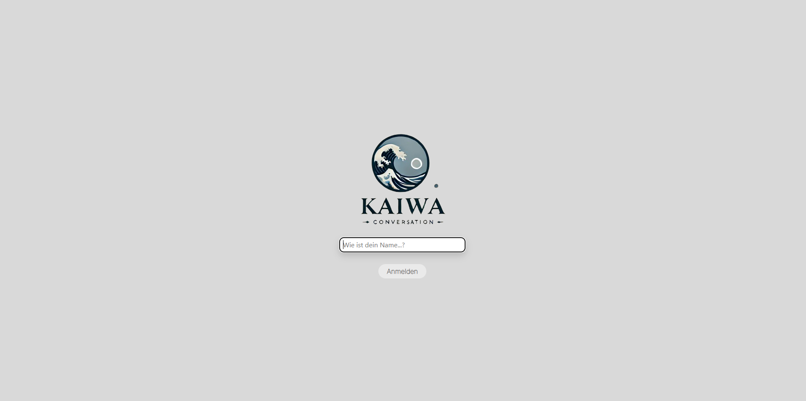
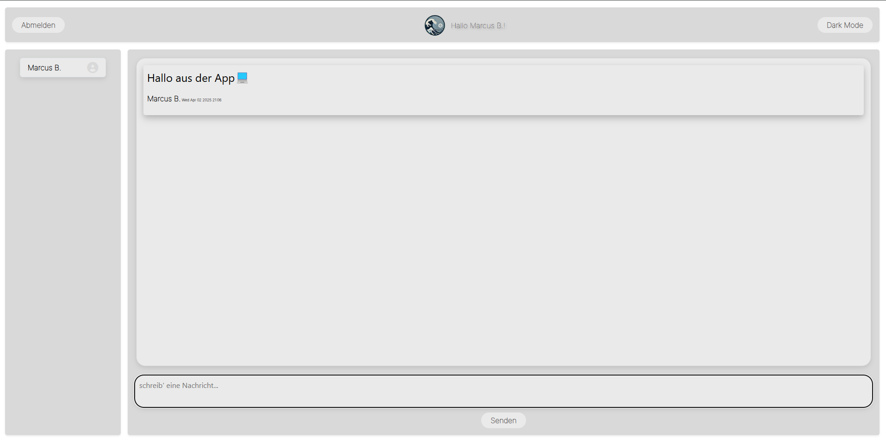

# project-kaiwa

## Abschlussprojekt – Experte für Cloud- und Webentwicklung (README ist noch in Bearbeitung stand 29.04.25)

Im Rahmen meiner Weiterbildung zum **Experten für Cloud- und Webentwicklung** bei der Techstarter GmbH (15.04.2024 – 09.04.2025) habe ich zusammen mit 2 Kurs-Teilnehmern, während eines Gruppen-Projekts nach den ersten 6 Monaten der Weiterbildung, eine eigene Chat-App mit React und Socket.io entwickelt, die über eine WebSocket-Verbindung kommuniziert. Das Projekt wurde in einem Scrum-Prozess aufgebaut und nutzt React, Socket.io, Express.js, SQLite und Nginx auf einer AWS EC2-Instanz. Mein Schwerpunkt lag auf der Umsetzung der Business-Logik, der Integration der WebSocket-Kommunikation, dem Aufbau des Express-Servers sowie der Nginx-Konfiguration und dem Deployment.

Im Rahmen meines Abschlussprojekts habe ich die bestehende App optimiert und weiterentwickelt. Ich habe Fehler bereinigt, die mir zum Zeitpunkt der Entwicklung noch nicht bewusst waren, und habe sie um Software-Testing, Monitoring und moderne DevOps-Komponenten erweitert.

Das Projekt zielt darauf ab, ein realitätsnahes Setup für den professionellen Einsatz zu gestalten. Dabei war mir besonders wichtig, dass möglichst viele Prozesse automatisiert und reproduzierbar sind. Die Infrastruktur besteht aus einer Dev- und einer Prod-Umgebung. Für das Infrastruktur-Setup habe ich Terraform eingesetzt. Ansible kommt für die Konfiguration der Systeme zum Einsatz.

Ein zentraler Fokus liegt auf der Frage, wie Tools wie **Terraform, Jenkins und Ansible sinnvoll zusammenarbeiten** – nicht nur als Einzelkomponenten, sondern als integriertes, robustes System, von der Jenkins-Installation bis zum finalen Deployment der containerisierten Applikation.

Die CI/CD-Pipeline ist dabei so aufgebaut, dass beim Push in den Dev-Branch Unit- und Integrationstests für Front- und Backend durchgeführt werden. Die App wird gebaut und direkt mit Nginx auf einer virtuellen Instanz deployed. Beim Push in den Main-Branch erfolgt ein containerisiertes Deployment über Docker Hub und Docker Compose. Die Erreichbarkeit der App wird in beiden Fällen automatisch geprüft.

Auch das Monitoring wurde so einfach und effektiv wie möglich umgesetzt. Prometheus läuft auf einer der App-Instanzen, Grafana in der Cloud und der Node Exporter auf allen Hosts. Zusätzlich sendet der Express-Server Metriken via `prom-client` – z. B. wie viele Nutzer gerade angemeldet sind, wie viele sich jemals angemeldet haben, wie viele Nachrichten versendet wurden und wie viele davon in der letzten Stunde. Auch Jenkins ist ins Monitoring eingebunden.

---

## Projektziele

- Aufbau einer **vollständigen CI/CD-Pipeline** mit Jenkins
- **Automatisches Deployment** bei Änderungen in verschiedenen Branches
- Einführung von **Containerisierung** für Produktionsumgebungen
- Trennung von **Dev- und Prod-Umgebungen**
- Implementierung eines **Monitoring-Stacks** mit Prometheus und Grafana
- Nutzung von **Infrastructure as Code** (Terraform)
- **Automatisierte Konfiguration der Infrastruktur** (Ansible)
- **Automatisiertes Setup** mit Bash-Skripten
- Einrichtung einer produktionsnahen Infrastruktur auf AWS (nachträglich auch auf Microsoft Azure)

---

## Architektur

Die Architektur besteht aus mehreren virtuellen Maschinen in der Cloud, die unterschiedliche Aufgaben erfüllen:

| Komponente          | Beschreibung                                                                 |
|---------------------|------------------------------------------------------------------------------|
| Jenkins-Server      | Führt CI/CD-Prozesse aus                                                     |
| Jenkins-Agent       | Unterstützt Jenkins bei Build- und Deploymentprozessen                       |
| App-Server-Dev      | Direkter Deployment-Host für die Entwicklungsumgebung                        |
| App-Server-Prod     | Containerisiertes Deployment über Docker Compose                             |
| Monitoring-Server   | Läuft auf App-Dev, beherbergt Prometheus, Grafana wird in der Cloud genutzt  |

Weitere Bestandteile:

- **Ansible**: Automatisierte Einrichtung von Jenkins, Plugins, Deployments, Monitoring, Konfigurationen
- **Terraform**: Bereitstellung der Infrastruktur (Azure und AWS)
- **Docker**: Containerisierung für die Prod-Umgebung
- **GitHub**: Versionierung & `Jenkinsfile` als zentrale Pipeline-Definition
- **Express.js Metrics**: Nutzung von `prom-client` für eigene Metriken

---

## Terraform

Die Infrastruktur für dieses Projekt wurde in erster Linie mit AWS als Cloud Provider realisiert, ich habe aber auch ein Skript für Microsoft Azure erstellt.

### AWS-Komponenten

- **Key-Pair** für sichere SSH Verbindung mit allen Instanzen
  - Private-Key wird lokal in ~/.ssh gespeichert mit korrekten permissions
- **Jenkins-Sicherheitsgruppe**
  - Port 22 Ingress (SSH)
  - Port 8080 Ingress (Jenkins)
- **Web-Sicherheitsgruppe**
  - Port 22 Ingress (SSH)
  - Port 80 Ingress (HTTP)
- **2 Jenkins-Instanzen** (EC2)
  - Ubuntu-Server (ami)
  - t3.large (instance type)
  - Jenkins-Sicherheitsgruppe
- **2 Web-Instanzen** (EC2)
  - Ubuntu-Server (ami)
  - t2.micro (instance type)
  - Web-Sicherheitsgruppe
- **Terraform-Outputs**
  - Public-IP's der Jenkins-Instanzen
  - Public-IP's der Web-Instanzen
  - Pfad zum Private-Key

### Azure-Komponenten

Für das selbe Setup müssen bei Azure als Cloud Provider wesentlich mehr Komponenten in Terraform beschrieben werden
- **Ressourcen-Gruppe** (bestehend oder neu)
- **Key-Pair** für sichere SSH Verbindung mit allen Instanzen
  - Private-Key wird lokal in ~/.ssh gespeichert mit korrekten permissions
- **Virtuell-Network** 
  - 10.0.0.0/16 (address space)
- **Subnet**
  - 10.0.1.0/24 (address prefixes)
- **Jenkins-Sicherheitsgruppe**
  - Port 22 Inbound (SSH)
  - Port 8080 Inbound (Jenkins)
  - Port 9100 Inbound (Monitoring - Node Exporter)
- **Web-Sicherheitsgruppe**
  - Port 22 Inbound (SSH)
  - Port 80 Inbound (HTTP)
  - Port 9090 Inbound (Monitoring - Prometheus)
  - Port 9100 Inbound (Monitoring - Node Exporter)
  - Port 3001 Inbound (Monitoring - Prom-Client)
- **Public IP's**
  - Static
- **Network Interface - nic**
  - Für jede Instanz
- **Network Interface Securitygroup Association - Jenkins**
  - Verbinden der Network Interfaces mit Sicherheitsgruppe als extra Ressource
- **Network Interface Securitygroup Association - Web**
  - Verbinden der Network Interfaces mit Sicherheitsgruppe als extra Ressource
- **2 Azure VM's Jenkins**
  - Ubuntu-Server-Jammy
  - Size Standart_B1s (zu klein für Jenkins)
  - Weitere Einstellungen (siehe main.tf)
- **2 Azure VM's Web**
  - Ubuntu-Server-Jammy
  - Size Standart_B1s
  - Weitere Einstellungen (siehe main.tf)
- **Terraform-Outputs**
  - Public-IP's der Jenkins-Instanzen
  - Public-IP's der Web-Instanzen
  - Pfad zum Private-Key

---

## Ansible

Nachdem Terraform die Infrastruktur erstellt hat, kann mit Ansible zunächst die Verbindung zu allen Instanzen, mit dem Playbook `check_connenction.yml`, überprüft werden. Wenn Ansible eine stabile Verbindung zu allen Instanzen hat, kann mit der Konfiguration der Instanzen begonnen werden.

### Jenkins Server
- **jenkins.yml**
  - Rollenbasierte Installation von Java & Jenkins (geerlingguy.java, geerlingguy.jenkins)
  - Installiert benötigte Plugins:
    - workflow-aggregator
    - pipeline-stage-view
    - ssh-agent
    - github
    - nodejs
    - prometheus-metrics-plugin (nicht zuverlässig, muss manuell nachinstalliert werden)
  - Lädt Jenkins-CLI herunter
  - Konfiguriert NodeJS Plugin
  - Erstellt Pipeline-Job mit Jenkins-CLI mit Referenz zum GitHub Repository
  - fügt den SSH-Key aus den Terraform Outputs als Credentials in Jenkins hinzu
    für Zugriff auf die Instanzen

### Jenkins Agent
- **jenkins_docker_node.yml**
  - Installiert Java um als Jenkins Agent fungieren zu können
  - Installiert Docker um Docker Prozesse ausführen zu können
  - Fügt User Ubuntu & Jenkins der Gruppe Docker hinzu

### App Server Dev
- **app_ec2.yml**
  - Installiert Nginx und richtet es als Service ein
  - Installiert NodeJS
  - Installiert PM2 und richtet es als Service ein

### App Server Prod
- **docker_app_ec2.yml**
  - Installiert Docker 
  - Fügt User Ubuntu & Jenkins zu Gruppe Docker hinzu

### Weitere Playbooks
- **check_connection.yml**
  - Fügt alle Hosts aus dem Inventory lokal zu known_hosts hinzu
  - Prüft die Erreichbarkeit zu allen Hosts
- **node_exporter.yml**
  - Installiert Node Exporter 
  - Richtet Node Exporter als Service ein
- **install_prometheus.yml**
  - Lädt Prometheus Binärdateien herunter
  - Erstellt einen Dienst für Prometheus
  - Konfiguriert prometheus.yml mit allen Hosts aus dem Ansible-Inventory

---

## Automatisierung durch Bash-Skripte

Bei der Arbeit an diesem Projekt, war eines meiner Ziele Reproduzierbarkeit. Für spätere Teilnehmer von Techstarter, oder einfach Interessierte, sollte dieses Projekt einfach nachzumachen und nachzuvollziehen sein. Wenn die Vorraussetzungen erfüllt sind, erledigen die Skripte fast die gesamte Arbeit bis auf ein paar wenige manuelle Eingriffe.

### Starten der Infrastruktur
- **infra_start.sh**
  - Initialisieren und starten des Terraform Deployments mit Prüfung ob Deployment bereits vorhanden ist
  - Abrufen der Terraform Ouputs:
    - Jenkins IP's
    - Web IP's
    - Private Key Pfad
    - Public Key Name
  - Speichern der Outputs in Variablen
  - Erstellen der Ansible Konfigurationsdateien "inventory.ini" & "ansible.cfg"
  - Ansible Testlauf, starten des Playbooks "check_connection.yml"
  - Ausgabe von konfigurierten SSH-Befehlen und URL's für manuelles Verbinden zu den Instanzen bzw. Aufrufen im Browser
  - Bedingtes Starten von "install.sh"

- **install.sh**
  - Erstellen bzw. Bereinigen des "logs"-Verzeichnisses
  - Parralleles Starten der Playbooks `jenkins.yml`, `jenkins_docker_node.yml`, `app_ec2.yml` und `docker_app_ec2.yml`
  - Erstellen von Logs für die Playbooks
  - Prüfen der Logs auf Fehler während der Plays
  - Ausgabe eventueller Fehler

### Stoppen der Infrastruktur
- **infra_down.sh**
  - Exportieren der HOME-Variable
  - Ausgabe der bestehenden Infrastruktur
  - Bedingtes Löschen der Infrastruktur

---

## CI/CD-Pipeline im Überblick

Die CI/CD-Pipeline ist branch-basiert aufgebaut:

### Development-Branch

- Trigger: Push auf `dev`
- Schritte:
  1. Klonen des Repositorys
  2. Testausführung (API, Socket.io, Datenbank)
  3. Testausführung (Frontend Komponenten)
  4. Build der App
  5. Deployment des Backends auf die App-Instanz (mit PM2)
  6. Deployment des Frontends auf die App-Instanz (mit Nginx)
  7. Erreichbarkeitsprüfung

### Main-Branch (Production)

- Trigger: Push auf `main`
- Schritte:
  1. Klonen des Repositorys
  2. Testausführung (API, Socket.io, Datenbank)
  3. Testausführung (Frontend Komponenten)
  4. Build Backend Container-Image (Docker)
  5. Build Frontend Container-Image (Multi-Stage-Build)
  6. Push zu Docker Hub (Frontend- und Backend-Image)
  7. Kopieren der Docker-Compose-File auf die Docker-App-Instanz
  8. Deployment per `docker compose` auf Docker-App-Instanz
  9. Erreichbarkeitsprüfung

---

## Monitoring

Der Monitoring-Stack besteht aus:

- **Prometheus** (läuft auf App-EC2)
- **Grafana** (Docker-Container)
- **Node Exporter** (auf allen relevanten Instanzen)
- **Jenkins Prometheus Plugin** für CI/CD-bezogene Metriken
- **Express.js eigene Metriken**:
  - Aktuell eingeloggte User
  - Gesamtanzahl eingeloggter User
  - Gesamtanzahl gesendeter Nachrichten
  - Nachrichtenanzahl der letzten Stunde

---

## Anleitung zur Ausführung

Eine detaillierte Anleitung zur Inbetriebnahme (inkl. Terraform, Ansible, Jenkins, Deployment, Monitoring) folgt im unteren Teil der README – mit klaren Schritten zur Reproduktion auf eigener Infrastruktur oder in der Cloud.

---

> Das vollständige Projekt inkl. Code findest du im Repository:
> 👉 [GitHub: Kaiwa Chat-App mit DevOps-Pipeline](https://github.com/marcusBieber/Kaiwa)

---

Möchtest du jetzt, dass ich direkt den nächsten Teil – die **technische Anleitung zur Ausführung** – in diesem Stil fertig schreibe?
